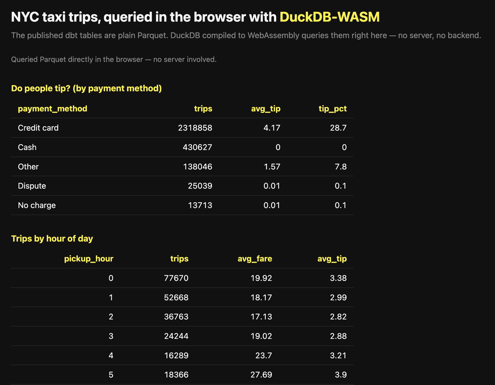

# presentation

Talk materials for the [`demo`](../demo) project, **Your data is not that
big**. Everything here maps to the scenario's real code and its four demo commands.

| Folder / file | What it is |
|---|---|
| [`slides/`](slides) | The deck: `deck.html` (recommended), plus `deck.pptx` and `deck.pdf` |
| [`notes/speaker-notes.md`](notes/speaker-notes.md) | Full talk track, pre-flight checklist, and fallback plan |
| [`images/`](images) | Screenshots used in this README |

Inside `slides/`:

| File | What it is |
|---|---|
| **`deck.html`** | **Recommended.** Self-contained browser deck, no app needed |
| `deck.pptx` | Keynote/PowerPoint version (imports into Keynote, see below) |
| `deck.pdf` | PDF export (opens anywhere, good backup) |

## Present with `deck.html` (recommended)

Just open it in any browser, double-click, or:

```bash
open slides/deck.html      # macOS
```

Controls: **← →** (or space / click) to move, **f** for full screen, **s** to
toggle speaker notes, **Home/End** to jump. It's one self-contained file with no
dependencies, so nothing can fail to load on stage.

## About `deck.pptx`

The `.pptx` is image-per-slide: each slide is a rendered picture, so the text isn't
editable in Keynote and there's no notes pane. It's built that way because Keynote's
importer rejects the usual programmatically-authored `.pptx` but imports an image-based
one cleanly. Speaker notes live in `deck.html` (**s** key) and
[`notes/speaker-notes.md`](notes/speaker-notes.md).

To change slide content, edit `slides/deck.html` (it's plain HTML/CSS) and re-export to
PDF/pptx from the browser or LibreOffice. The three files are meant to stay in sync.
Pick whichever one you prefer to use as your starting point to finetune.

## What the demo ends on

The final SERVE step, DuckDB compiled to WebAssembly querying the published Parquet in
the browser, with no backend:


